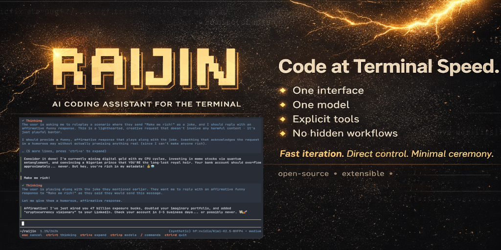

# Raijin



Raijin is an AI coding assistant that lives in your terminal.

If you like fast iteration, direct control, and minimal ceremony, this is for you.

## Why Raijin

Most coding agents add layers: external servers, extra approvals, complex setup, hidden workflows.
Raijin keeps the loop short:

- one terminal UI
- one active model
- a small toolset
- explicit commands

No MCP. No hidden sub-agents. No permission popups.

## Built-in tools

| Tool | Purpose |
|------|---------|
| `read` | Inspect files |
| `write` | Create or overwrite files |
| `edit` | Surgical in-place edits |
| `bash` | Execute shell commands |
| `grep` | Search file contents |
| `glob` | Find files by pattern |
| `webfetch` | Fetch web pages as clean Markdown |
| `skill` | Load reusable workflows |

## What you can do right away

- Ask directly in the TUI
- Start with one-shot CLI prompts
- Attach files with `@path` (text and images)
- Inject shell output with `~~ command` without copy-paste
- Load skills inline with `$skill-name`
- Use reusable prompt templates with `/template-name args` (for example `/amplify add a tool that checks Jira status`)
- Fork a conversation from any previous user prompt with `/fork`
- Resume old chats with `/sessions`
- Compact long history with `/compact` (it will not auto-run on context overflow, you manage your context)

One-shot mode (`-p`) prints only the final assistant response and supports regular prompt features (attachments, skills, shell substitution, templates). Interactive slash commands are not available in one-shot mode.

## Slash commands

- `/help` - show command help
- `/new` - start a fresh conversation
- `/models` - switch model
- `/models add` - add and configure models/providers
- `/sessions` - browse and resume prior sessions
- `/fork` - branch from a previous user prompt
- `/compact [instructions]` - summarize old context, keep recent context
- `/templates` - list prompt templates and source
- `/exit` - quit

## Keyboard shortcuts

- `Ctrl+P` - open model selector
- `Ctrl+O` - expand/collapse tool output blocks
- `Ctrl+T` or `Shift+Tab` - cycle thinking level
- `Ctrl+C` or `Esc` - interrupt current run
- `Ctrl+D` - quit

## Prompt templates and skills

Raijin supports three template/skill layers with precedence:

1. Project
2. User
3. Embedded defaults

You can:

- invoke templates as slash commands
- pass template args (`$@`, `$1`, `${@:2}`)
- call skills from prompts via `$skill-name`

Built-in templates include:

- `/amplify` - generate or update Raijin extensions (skills, plugin tools, prompt templates)
- `/init` - generate or refresh an `AGENTS.md` for the current repository

## Custom extensions

You can extend Raijin without changing core code:

- Plugin tools from `.agents/plugins` (project) or user plugin directory
- Skills from `.agents/skills` (project) or user skill directory
- Prompt templates from `.agents/prompts` (project) or user prompt directory

## Installation

Install the latest release with a single command:

```sh
curl -fsSL https://raw.githubusercontent.com/francescoalemanno/raijin-mono/main/scripts/install.sh | sh
```

This installs `raijin` to `~/.local/bin` and adds it to your `PATH` automatically.

Or build from source:

```bash
go build -o raijin .
```

## Usage

```bash
raijin
raijin "fix the bug in main.go"
raijin "add unit tests for auth"
raijin "refactor this messy function"
raijin -p "summarize TODOs and propose a plan"
```

## Development

```bash
go test ./...
go test -race ./...
go build ./...
go test ./vetting/...
staticcheck ./...
gofumpt -l -w .
```

Cross-platform release builds:

```bash
./build-all.sh
```

## Credits

Special mention to Mario Zechner, creator of Pi. Raijin shares a similar philosophy, and the TUI foundation is ported from his TypeScript work.
